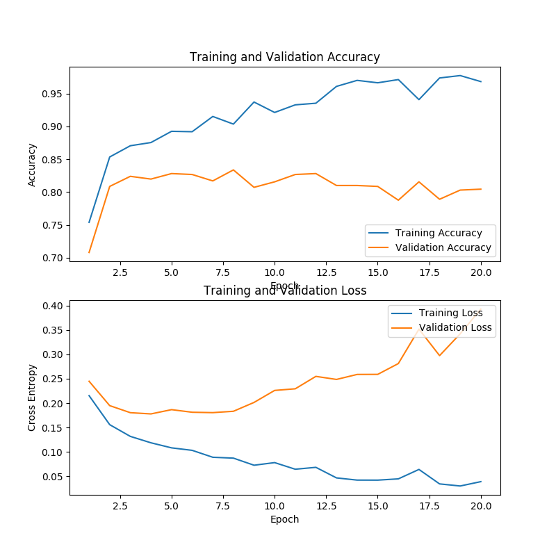
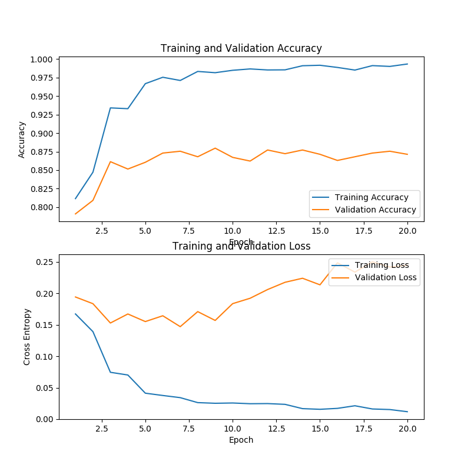
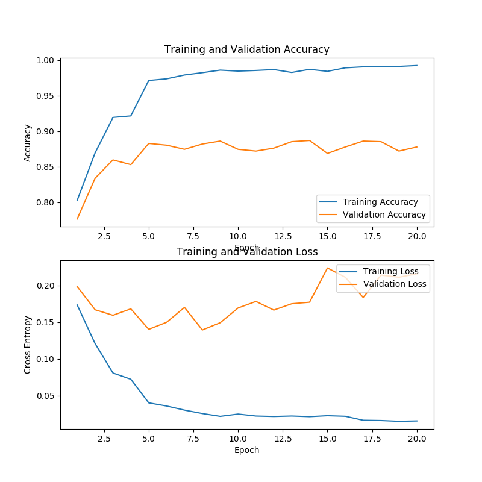
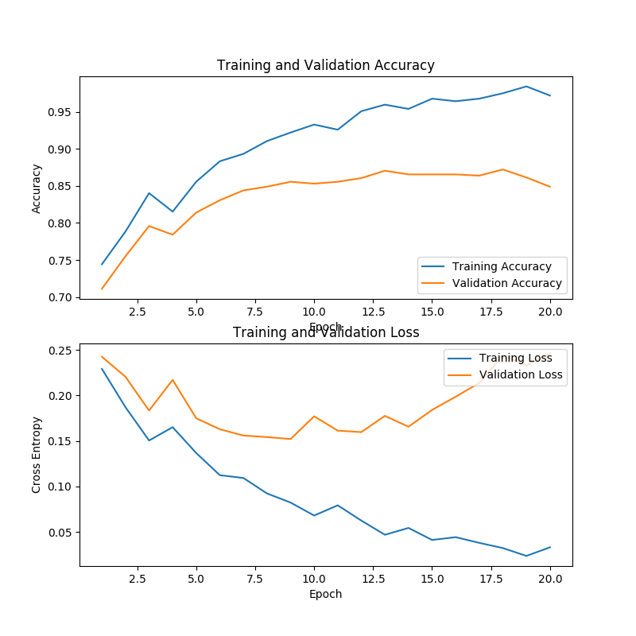
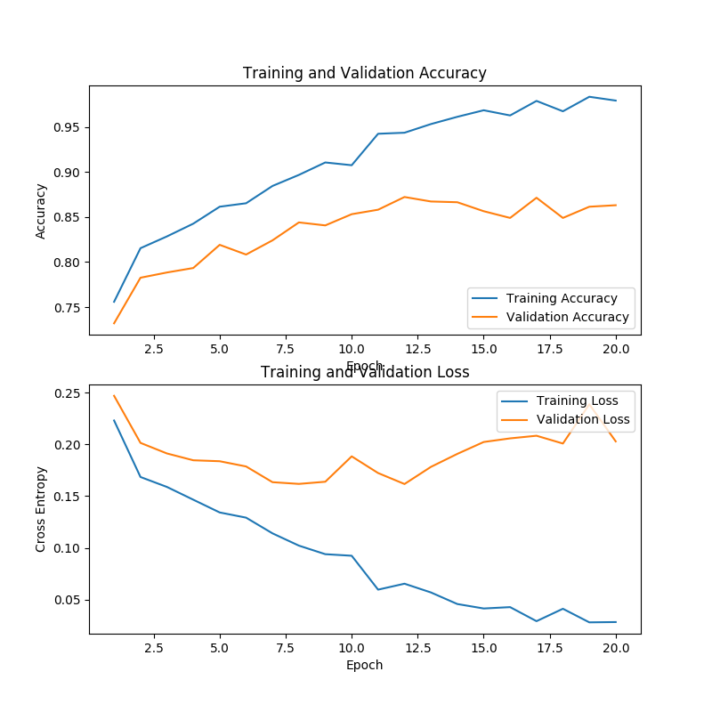
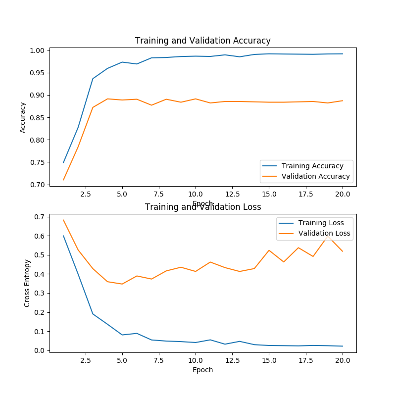
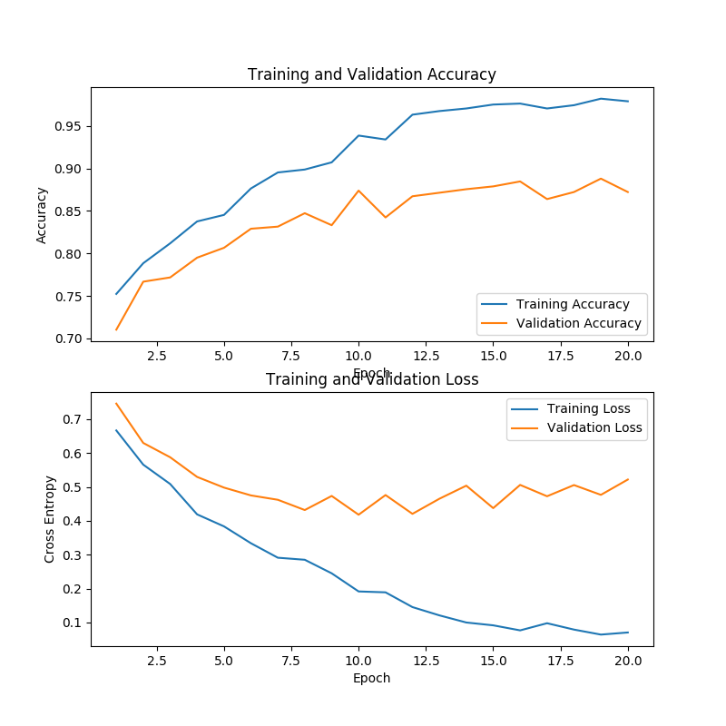

# Domain Adaptation Test with Different Models.

    1. separate domain train & Test --> Not Good Result
    2. mix of domains train & Test (train will have small amount from other domain & test will have complete data) --> Good Result
    3. Transfer Learning --> need to do test
    4. Transformer --> Best result

## Metrics to validate model

#### Different Model architecture
    1. logistic regression with LSTM - input(text & label) - pretrained-feature(word2vec,hotvec)
    1. logistic regression with LSTM - input(text & label) - pretrained-feature(BERT)
    2. CEA - input(text, entity , entity_distance_loc & label) - pretrained-feature(word2vec,hotvec)
    2. CEA - input(text, entity , entity_distance_loc & label) - pretrained-feature(BERT)
    3. multi-layer RNN
    4. multi-layer LSTM
    5. BiLSTM
    6. multi-layer BiLSTM
    7. CNN-LSTM
    ..etc.

#### Test Metrics(data distribution & measurement)
    1. randomly sampled train/test dataset (may or maynot same feature in both)
    2. randomly sampled train/test dataset with test having new feature
    3. after applying 1. then try with different domain.

    1. Accuracy , F1 score , Recall

## Result Analysis( for users who are not interested in going into experiments details.)
##### Order wise models performances
    1. Bert (LM-Transformer)
    2.SLSTM & CEA (using word2vec, non-linear transformation for getting sentence vec.) (CEA would be more preferable if sentence length is big. min 100+ words.)
    3.ConvLSTM (using word2vec, non-linear transformation for getting sentence vec.)
    4.Random Forest (using word2vec, minmax for getting sentence vec.)
    5.SSVM, Logistic Regression (using word2vec, minmax for getting sentence vec.)

## Experiments
### data train/test (2 domain data "ms(finance) & St(News)". file name starts with ms_St are combined one)
      number_of_samples file_name
      400000 glove.6B.300d.txt
      2668 ms_St1k_train_data
      1216 ms_St500_test_data
      6669 ms_St5k_train_data
       716 ms_test_data
      1670 ms_train_data
       500 St_test_data_500
      1656 St_test_data
      1156 St_test_data_ex500
       998 St_train_data_1k
      4999 St_train_data_5k
     14984 St_train_data
     
     St1k                   
    Negative       86           86
    Neutral       694          694
    Positive      217          217
    
    St5k
    Negative      443          443
    Neutral      3464         3464
    Positive     1091         1091
    
    ms_St1k
    Negative      434          434
    Neutral       835          835
    Positive     1398         1398
    
    ms_St5k
    Negative      791          791
    Neutral      3606         3606
    Positive     2271         2271
    
    ms_St500_test
    Negative      190          190
    Neutral       427          427
    Positive      598          598
    
    ms_train
    Negative      348          348
    Neutral       141          141
    Positive     1180         1180
    
    ms_test
    Negative      153          153
    Neutral        74           74
    Positive      488          488
    
    St_train
    Negative     1099         1099
    Neutral     10539        10539
    Positive     3345         3345
    
    St_test
    Negative      121          121
    Neutral      1166         1166
    Positive      368          368
    
    St_test_exclude500
    Negative       85           85
    Neutral       812          812
    Positive      258          258

     
     maxlen of text from samples: 68 61 , avg len of text : 21 , but choosen len is : 45

## Using CEA
#### CEA model parametrers
    `batch_size_init = 25
    n_hidden_init = 300
    learning_rate_init = 0.001
    n_class_init = 3
    l2_reg_init = 0.001
    n_iter_init = 20
    keep_prob0_init = 0.8
    keep_prob1_init = 0.5
    keep_prob2_init = 0.5
    method = 'CEA'
    hopnum = 3`
    Architecture :: context embdding->dropout->LSTM->Entitymemorisation->dropout->Fc->softmax
    regularization : yes
    

### ms data
#### Train 
all samples=1638, correct prediction in train=1586.0
Iter 19: mini-batch loss=0.039114, train acc=0.968254
Precision 0.9749216300940439
Recall 0.9749216300940439
f1_score 0.9749216300940439
Optimization Finished! Max acc=0.8337988826815642
mathod=	CEA	acc=	0.8044692737430168	Learning_rate=	0.001	iter_num=	20	batch_size=	25	hidden_num=	300	l2=	0.001	traintime=	211.81935214996338	testtime=	0.5013391971588135	hopnum=	3	maxacc=	0.8337988826815642

#### Test
inside restore : 
all samples=1616, correct prediction=595.0
mini-batch loss=0.981077, test acc=0.368193
Precision 0.37337662337662336
Recall 0.37337662337662336
f1_score 0.3733766233766233
`classification_report                precision    recall  f1-score   support

           0       0.08      0.26      0.12        34
           1       0.78      0.27      0.40       438
           2       0.30      0.72      0.42       144

   micro avg       0.37      0.37      0.37       616
   macro avg       0.38      0.42      0.31       616
weighted avg       0.63      0.37      0.39       616
`

### ms-St5k  & 500-test combined  & without tag-data combined
### Train
all samples=6478, correct prediction in train=6411.0
Iter 19: mini-batch loss=0.015537, train acc=0.989657
Precision 0.997907949790795
Recall 0.997907949790795
f1_score 0.997907949790795
Optimization Finished! Max acc=0.8838174273858921
mathod=	CEA	acc=	0.8813278008298755	Learning_rate=	0.001	iter_num=	20	batch_size=	25	hidden_num=	300	l2=	0.001	traintime=	431.16371297836304	testtime=	1.388157844543457	hopnum=	3	maxacc=	0.8838174273858921

### Test
inside restore : 
all samples=1127, correct prediction=987.0
mini-batch loss=0.216314, test acc=0.875776
Precision 0.7322834645669292
Recall 0.7322834645669292
f1_score 0.732283464566929
classification_report                precision    recall  f1-score   support

           0       0.00      0.00      0.00         5
           1       0.82      0.86      0.84        96
           2       0.50      0.38      0.43        26

   micro avg       0.73      0.73      0.73       127
   macro avg       0.44      0.42      0.43       127
weighted avg       0.72      0.73      0.73       127

### ms-St5k  & 500-test combined & tag-data combined
### Train
all samples=6478, correct prediction in train=6430
Iter 19: mini-batch loss=0.216037, test acc=0.878008
all samples=6478, correct prediction in train=6430.0
Iter 19: mini-batch loss=0.015504, train acc=0.992590
Precision 0.997907949790795
Recall 0.997907949790795
f1_score 0.997907949790795
Optimization Finished! Max acc=0.8871369294605809
mathod=	CEA	acc=	0.8780082987551867	Learning_rate=	0.001	iter_num=	20	batch_size=	25	hidden_num=	300	l2=	0.001	traintime=	434.7440981864929	testtime=	1.3775684833526611	hopnum=	3	maxacc=	0.8871369294605809

### Test
inside restore : 
all samples=1127, correct prediction=980.0
mini-batch loss=0.246681, test acc=0.869565
Precision 0.7559055118110236
Recall 0.7559055118110236
f1_score 0.7559055118110235
classification_report                precision    recall  f1-score   support

           0       0.00      0.00      0.00         5
           1       0.83      0.90      0.86        96
           2       0.56      0.38      0.45        26

   micro avg       0.76      0.76      0.76       127
   macro avg       0.46      0.43      0.44       127
weighted avg       0.74      0.76      0.75       127

### Tuning
### tuning-appr-1
1. No dropout at begining with dropout prob 0.8
2. numhop = 2
### Train
### Test

### ms-St1k-train & 500-test combined & without tag-data combined
### Train
all samples=2605, correct prediction in train=2532.0
Iter 19: mini-batch loss=0.033248, train acc=0.971977
Precision 0.9867768595041322
Recall 0.9867768595041322
f1_score 0.9867768595041322
Optimization Finished! Max acc=0.8721991701244813
mathod=	CEA	acc=	0.8489626556016597	Learning_rate=	0.001	iter_num=	20	batch_size=	25	hidden_num=	300	l2=	0.001	traintime=	258.22920846939087	testtime=	0.7637825012207031	hopnum=	3	maxacc=	0.8721991701244813

### Test
inside restore : 
all samples=1127, correct prediction=923.0
mini-batch loss=0.204928, test acc=0.818988
Precision 0.6929133858267716
Recall 0.6929133858267716
f1_score 0.6929133858267716
classification_report                precision    recall  f1-score   support

           0       0.10      0.20      0.13         5
           1       0.83      0.77      0.80        96
           2       0.46      0.50      0.48        26

   micro avg       0.69      0.69      0.69       127
   macro avg       0.47      0.49      0.47       127
weighted avg       0.73      0.69      0.71       127

### ms-St1k-train & 500-test combined & tag-data combined
### Train
all samples=2605, correct prediction in train=2551.0
Iter 19: mini-batch loss=0.028375, train acc=0.979271
Precision 0.9917355371900827
Recall 0.9917355371900827
f1_score 0.9917355371900827
Optimization Finished! Max acc=0.8721991701244813
mathod=	CEA	acc=	0.8630705394190872	Learning_rate=	0.001	iter_num=	20	batch_size=	25	hidden_num=	300	l2=	0.001	traintime=	258.4575004577637	testtime=	0.7425892353057861	hopnum=	3	maxacc=	0.8721991701244813

### Test
inside restore : 
all samples=1127, correct prediction=912.0
mini-batch loss=0.216015, test acc=0.809228
Precision 0.6850393700787402
Recall 0.6850393700787402
f1_score 0.6850393700787402
`classification_report                precision    recall  f1-score   support

           0       0.15      0.40      0.22         5
           1       0.80      0.77      0.79        96
           2       0.50      0.42      0.46        26

   micro avg       0.69      0.69      0.69       127
   macro avg       0.49      0.53      0.49       127
weighted avg       0.72      0.69      0.70       127
`

## Using SLSTM
    `batch_size_init = 25
        n_hidden_init = 300
        learning_rate_init = 0.001
        n_class_init = 3
        l2_reg_init = 0.001
        n_iter_init = 20
        keep_prob0_init = 0.8
        keep_prob1_init = 0.5
        keep_prob2_init = 0.5
        method = 'MLSTM'
        Architecture :: (context embd->drop->1 layers of LSTM->drop+Fc+softmax)
        regularization : yes
### ms-St5k  & 500-test combined
### Train
all samples=6478, correct prediction in train=6426.0
Iter 19: mini-batch loss=0.022121, train acc=0.991973
Precision 0.99581589958159
Recall 0.99581589958159
f1_score 0.99581589958159
Optimization Finished! Max acc=0.891286307053942
mathod=	SLSTM	acc=	0.8871369294605809	Learning_rate=	0.001	iter_num=	20	batch_size=	25	hidden_num=	300	l2=	0.001	traintime=	272.9167993068695	testtime=	0.5588569641113281	hopnum=	0	maxacc=	0.891286307053942

### Test
inside restore : 
all samples=1127, correct prediction=987.0
mini-batch loss=0.713777, test acc=0.875776
Precision 0.7165354330708661
Recall 0.7165354330708661
f1_score 0.716535433070866
classification_report                precision    recall  f1-score   support

           0       0.20      0.60      0.30         5
           1       0.84      0.78      0.81        96
           2       0.57      0.50      0.53        26

   micro avg       0.72      0.72      0.72       127
   macro avg       0.54      0.63      0.55       127
weighted avg       0.76      0.72      0.73       127

### ms-St1k  & 500-test combined
### Train
all samples=2605, correct prediction in train=2550.0
Iter 19: mini-batch loss=0.070477, train acc=0.978887
Precision 0.9818181818181818
Recall 0.9818181818181818
f1_score 0.9818181818181818
Optimization Finished! Max acc=0.8879668049792531
mathod=	SLSTM	acc=	0.8721991701244813	Learning_rate=	0.001	iter_num=	20	batch_size=	25	hidden_num=	300	l2=	0.001	traintime=	152.01242542266846	testtime=	0.29947662353515625	hopnum=	0	maxacc=	0.8879668049792531

### Test
inside restore : 
all samples=1127, correct prediction=936.0
mini-batch loss=0.594613, test acc=0.830524
Precision 0.7322834645669292
Recall 0.7322834645669292
f1_score 0.732283464566929
`classification_report                precision    recall  f1-score   support

           0       0.14      0.20      0.17         5
           1       0.84      0.84      0.84        96
           2       0.48      0.42      0.45        26

   micro avg       0.73      0.73      0.73       127
   macro avg       0.49      0.49      0.49       127
weighted avg       0.73      0.73      0.73       127
`
## Using lstm-rnn
    `batch_size_init = 25
        n_hidden_init = 300
        learning_rate_init = 0.001
        n_class_init = 3
        l2_reg_init = 0.001
        n_iter_init = 20
        keep_prob0_init = 0.8
        keep_prob1_init = 0.5
        keep_prob2_init = 0.5
        method = 'MLSTM'
        Architecture :: (context embd->drop->2 layers of LSTM->dropwrapper->drop+Fc+softmax)
        regularization : yes
### ms-St5k  & 500-test combined
### Train(context embd->drop->2 layers of LSTM->dropwrapper->drop+Fc+softmax)
Iter 0: mini-batch loss=0.956434, train acc=0.534733
Precision 0.7154811715481172
Recall 0.7154811715481172
f1_score 0.7154811715481171
Optimization Finished! Max acc=0.34688796680497924
mathod=	MLSTM	acc=	0.34688796680497924	Learning_rate=	0.001	iter_num=	20	batch_size=	25	hidden_num=	300	l2=	0.001	traintime=	80.40762877464294	testtime=	19.894213914871216	hopnum=	0	maxacc=	0.34688796680497924
### Train(context embd->2 layers of LSTM->dropwrapper->Fc->softmax)
all samples=6478, correct prediction in train=3464.0
Iter 0: mini-batch loss=0.955207, train acc=0.534733
Precision 0.7154811715481172
Recall 0.7154811715481172
f1_score 0.7154811715481171
Optimization Finished! Max acc=0.34688796680497924
mathod=	MLSTM	acc=	0.34688796680497924	Learning_rate=	0.001	iter_num=	20	batch_size=	25	hidden_num=	300	l2=	0.001	traintime=	81.28921437263489	testtime=	20.27818536758423	hopnum=	0	maxacc=	0.34688796680497924

### Test
## Using Bi-LSTM(context embd->Bi-LSTM->drop->Fc->softmax) ## something Wrong in Arch.
### ms-St5k  & 500-test combined
### Train
all samples=6478, correct prediction in train=3466.0
Iter 0: mini-batch loss=0.915383, train acc=0.535042
Precision 0.7154811715481172
Recall 0.7154811715481172
f1_score 0.7154811715481171
Optimization Finished! Max acc=0.34688796680497924
mathod=	BiLSTM	acc=	0.34688796680497924	Learning_rate=	0.001	iter_num=	20	batch_size=	25	hidden_num=	300	l2=	0.001	traintime=	81.51741147041321	testtime=	20.682878971099854	hopnum=	0	maxacc=	0.34688796680497924

### Test
## Using conv-lstm(context embd->2 layer Conv-LSTM + reduce_max(1)->drop->Fc->softmax)
### ms-St5k  & 500-test combined
### Train
all samples=6478, correct prediction in train=6437.0
Iter 19: mini-batch loss=0.014747, train acc=0.993671
Precision 0.997907949790795
Recall 0.997907949790795
f1_score 0.997907949790795
Optimization Finished! Max acc=0.8929460580912864
mathod=	ConvLSTM	acc=	0.8796680497925311	Learning_rate=	0.001	iter_num=	20	batch_size=	25	hidden_num=	300	l2=	0.001	traintime=	488.4954504966736	testtime=	2.649756669998169	hopnum=	0	maxacc=	0.8929460580912864

### Test
inside restore : 
all samples=1127, correct prediction=976.0
mini-batch loss=0.790509, test acc=0.866016
Precision 0.7480314960629921
Recall 0.7480314960629921
f1_score 0.7480314960629921
classification_report                precision    recall  f1-score   support

           0       0.18      0.40      0.25         5
           1       0.85      0.83      0.84        96
           2       0.59      0.50      0.54        26

   micro avg       0.75      0.75      0.75       127
   macro avg       0.54      0.58      0.54       127
weighted avg       0.77      0.75      0.76       127
### ms-St1k  & 500-test combined
### Train
all samples=2605, correct prediction in train=2561.0
Iter 19: mini-batch loss=0.053546, train acc=0.983109
Precision 0.9867768595041322
Recall 0.9867768595041322
f1_score 0.9867768595041322
Optimization Finished! Max acc=0.8788381742738589
mathod=	ConvLSTM	acc=	0.8647302904564316	Learning_rate=	0.001	iter_num=	20	batch_size=	25	hidden_num=	300	l2=	0.001	traintime=	237.0113799571991	testtime=	1.3458473682403564	hopnum=	0	maxacc=	0.8788381742738589
### Test
inside restore : 
all samples=1127, correct prediction=918.0
mini-batch loss=0.655941, test acc=0.814552
Precision 0.7007874015748031
Recall 0.7007874015748031
f1_score 0.7007874015748031
classification_report                precision    recall  f1-score   support

           0       0.00      0.00      0.00         5
           1       0.81      0.85      0.83        96
           2       0.37      0.27      0.31        26

   micro avg       0.70      0.70      0.70       127
   macro avg       0.39      0.37      0.38       127
weighted avg       0.69      0.70      0.69       127

## Using SSVM(sentence vector using min_max over word vectors)
    Code - https://github.com/munaAchyuta/entity_based_sentiment_analysis/blob/master/sent_classfy_gensim_logit.ipynb
### ms-St5k Test
SVC(C=1.0, cache_size=200, class_weight=None, coef0=0.0,
  decision_function_shape='ovr', degree=8, gamma='auto_deprecated',
  kernel='poly', max_iter=-1, probability=False, random_state=None,
  shrinking=True, tol=0.001, verbose=False)
  
              precision    recall  f1-score   support

           0       0.00      0.00      0.00        85
           1       0.70      1.00      0.82       801
           2       0.00      0.00      0.00       255

   micro avg       0.70      0.70      0.70      1141
   macro avg       0.23      0.33      0.27      1141
weighted avg       0.49      0.70      0.58      1141

Final Accuracy: 0.7020157756354075
### ms-St1k Test
             precision    recall  f1-score   support

           0       0.00      0.00      0.00        85
           1       0.00      0.00      0.00       801
           2       0.22      1.00      0.37       255

   micro avg       0.22      0.22      0.22      1141
   macro avg       0.07      0.33      0.12      1141
weighted avg       0.05      0.22      0.08      1141

Final Accuracy: 0.22348816827344434
### ms-St5k Test
SVC(C=1.0, cache_size=200, class_weight=None, coef0=0.0,
  decision_function_shape='ovr', degree=8, gamma='auto_deprecated',
  kernel='rbf', max_iter=-1, probability=False, random_state=None,
  shrinking=True, tol=0.001, verbose=False)
  
             precision    recall  f1-score   support

           0       0.78      0.16      0.27        85
           1       0.77      0.95      0.85       801
           2       0.67      0.38      0.48       255

   micro avg       0.76      0.76      0.76      1141
   macro avg       0.74      0.50      0.53      1141
weighted avg       0.75      0.76      0.72      1141

Final Accuracy: 0.7598597721297108
### ms-St1k Test
              precision    recall  f1-score   support

           0       1.00      0.02      0.05        85
           1       0.73      0.95      0.83       801
           2       0.54      0.20      0.29       255

   micro avg       0.72      0.72      0.72      1141
   macro avg       0.76      0.39      0.39      1141
weighted avg       0.71      0.72      0.65      1141

Final Accuracy: 0.7151621384750219
### ms-St5k Test
SVC(C=1.0, cache_size=200, class_weight=None, coef0=0.0,
  decision_function_shape='ovr', degree=8, gamma='auto_deprecated',
  kernel='sigmoid', max_iter=-1, probability=False, random_state=None,
  shrinking=True, tol=0.001, verbose=False)
  
             precision    recall  f1-score   support

           0       0.00      0.00      0.00        85
           1       0.75      0.95      0.84       801
           2       0.63      0.30      0.40       255

   micro avg       0.73      0.73      0.73      1141
   macro avg       0.46      0.42      0.41      1141
weighted avg       0.66      0.73      0.68      1141

Final Accuracy: 0.733567046450482
### ms-St1k Test
              precision    recall  f1-score   support

           0       0.00      0.00      0.00        85
           1       0.72      0.96      0.82       801
           2       0.45      0.14      0.21       255

   micro avg       0.70      0.70      0.70      1141
   macro avg       0.39      0.37      0.34      1141
weighted avg       0.61      0.70      0.63      1141

Final Accuracy: 0.7037686240140227

### ms-St5k Test
CalibratedClassifierCV(base_estimator=SVC(C=1.0, cache_size=200, class_weight=None, coef0=0.0,
  decision_function_shape='ovr', degree=3, gamma='auto', kernel='rbf',
  max_iter=-1, probability=False, random_state=None, shrinking=True,
  tol=0.001, verbose=False),
            cv=3, method='sigmoid')
            
              precision    recall  f1-score   support

           0       0.80      0.09      0.17        85
           1       0.76      0.94      0.84       801
           2       0.63      0.35      0.45       255

   micro avg       0.75      0.75      0.75      1141
   macro avg       0.73      0.46      0.49      1141
weighted avg       0.74      0.75      0.71      1141

Final Accuracy: 0.7467134092900964
### ms-St1k Test
              precision    recall  f1-score   support

           0       0.00      0.00      0.00        85
           1       0.77      0.19      0.30       801
           2       0.23      0.85      0.36       255

   micro avg       0.32      0.32      0.32      1141
   macro avg       0.33      0.35      0.22      1141
weighted avg       0.59      0.32      0.29      1141

Final Accuracy: 0.32164767747589834

## Using LogisticRegression(sentence vector using min_max over word vectors)
### ms-St5k Train
Accuracy for C=1: 0.7685337726523888
### ms-St5k Test
Final Accuracy: 0.7563540753724802

              precision    recall  f1-score   support

           0       0.63      0.42      0.51        85
           1       0.81      0.89      0.84       801
           2       0.58      0.46      0.51       255

   micro avg       0.76      0.76      0.76      1141
   macro avg       0.67      0.59      0.62      1141
weighted avg       0.74      0.76      0.74      1141
### ms-St1k Test

## Using NB(sentence vector using min_max over word vectors)
### ms-St5k Test
GaussianNB(priors=None, var_smoothing=1e-09)

              precision    recall  f1-score   support

           0       0.22      0.54      0.32        85
           1       0.74      0.83      0.79       801
           2       0.56      0.09      0.15       255

   micro avg       0.64      0.64      0.64      1141
   macro avg       0.51      0.49      0.42      1141
weighted avg       0.67      0.64      0.61      1141

0.6432953549517967
### ms-St1k Test
             precision    recall  f1-score   support

           0       0.20      0.04      0.06        85
           1       0.70      0.98      0.82       801
           2       0.25      0.00      0.01       255

   micro avg       0.69      0.69      0.69      1141
   macro avg       0.38      0.34      0.30      1141
weighted avg       0.56      0.69      0.58      1141

Final Accuracy: 0.694127957931639

## Using Random Forest(sentence vector using min_max over word vectors)
### ms-St5k Test
 precision    recall  f1-score   support

           0       1.00      0.78      0.87        85
           1       0.88      0.95      0.91       801
           2       0.79      0.66      0.72       255

   micro avg       0.87      0.87      0.87      1141
   macro avg       0.89      0.79      0.83      1141
weighted avg       0.87      0.87      0.86      1141

Final Accuracy: 0.8685363716038562
### ms-St1k Test
              precision    recall  f1-score   support

           0       1.00      0.74      0.85        85
           1       0.86      0.95      0.91       801
           2       0.79      0.61      0.69       255

   micro avg       0.86      0.86      0.86      1141
   macro avg       0.88      0.77      0.81      1141
weighted avg       0.86      0.86      0.85      1141

Final Accuracy: 0.8588957055214724

# Domain Adaptation Test with Bert.

### separate domain train & Test
### mix of domains train & Test(train will have small amount from other domain & test will have complete data)

### Bert Default Config
    `Model config {
      "attention_probs_dropout_prob": 0.1,
      "hidden_act": "gelu",
      "hidden_dropout_prob": 0.1,
      "hidden_size": 768,
      "initializer_range": 0.02,
      "intermediate_size": 3072,
      "max_position_embeddings": 512,
      "num_attention_heads": 12,
      "num_hidden_layers": 12,
      "type_vocab_size": 2,
      "vocab_size": 30522
    }`

### data & label-wise distribution
    `1. two domains are. finance(ms) & news(St)`
    1669 -- ms_train
    715 -- ms_test
    1655 -- St_test
    14983 -- St_train
    2669 -- ms_St_1k
    1215 -- ms_St500_test
    6669 -- ms_St_5k
    `
    St-5k
    0       440      0       440
    1      3382      0      3382
    2      1069      0      1069
    `
    `
    St_1k
    0       90      0        90
    1      680      0       680
    2      208      0       208
    `
    `ms_St_5k::
    0       788      0       788
    1      3524      0      3524
    2      2248      0      2248`
    `
    ms_St_1k::
    0       438      0       438
    1       822      0       822
    2      1387      0      1387
    `
    `
    ms_St500_test
    0      189      0       189
    1      427      0       427
    2      598      0       598
    `
    `
    St_test
    label                       
    0       121      0       121
    1      1154      0      1154
    2       365      0       365
    `
    `
    St_test_excluding500
    label                       
    0       85      0       85
    1      812      0      812
    2      258      0      258
    `
    `
    St_train
    0       1091      0      1091
    1      10359      0     10359
    2       3292      0      3292
    `
    `
    ms_test
    0      152      0       152
    1       74      0        74
    2      488      0       488
    `
    `
    ms_train
    0       348      0       348
    1       141      0       141
    2      1179      0      1179
    `
### ms-1(same domain train/dev(1669/715)) ?below 90 because of non-equal or imbalance distribution of features.
    09/12/2019 08:40:36 - INFO - __main__ -   ***** Running evaluation *****
    09/12/2019 08:40:36 - INFO - __main__ -     Num examples = 715
    09/12/2019 08:40:36 - INFO - __main__ -     Batch size = 8
    Evaluating: 100%|███████████████████████████████| 90/90 [00:23<00:00,  4.49it/s]
    09/12/2019 08:40:59 - INFO - __main__ -   ***** Eval results *****
    09/12/2019 08:40:59 - INFO - __main__ -     eval_accuracy = 0.8643356643356643
    09/12/2019 08:40:59 - INFO - __main__ -     eval_loss = 0.38533345030413735
    09/12/2019 08:40:59 - INFO - __main__ -     global_step = 159
    09/12/2019 08:40:59 - INFO - __main__ -     loss = 0.2732406849006437
### ms-1(other domain train/dev(1669/1156))
    09/13/2019 07:49:36 - INFO - __main__ -   ***** Running evaluation *****
    09/13/2019 07:49:36 - INFO - __main__ -     Num examples = 1156
    09/13/2019 07:49:36 - INFO - __main__ -     Batch size = 8
    Evaluating: 100%|█████████████████████████████| 145/145 [00:36<00:00,  4.57it/s]
    09/13/2019 07:50:13 - INFO - __main__ -   ***** Eval results *****
    09/13/2019 07:50:13 - INFO - __main__ -     eval_accuracy = 0.5536332179930796
    09/13/2019 07:50:13 - INFO - __main__ -     eval_loss = 0.8990308214878214
    09/13/2019 07:50:13 - INFO - __main__ -     global_step = 0
    09/13/2019 07:50:13 - INFO - __main__ -     loss = None
### St-1(same domain train/dev(14983/1655)
    09/12/2019 09:36:47 - INFO - __main__ -   ***** Running evaluation *****
    09/12/2019 09:36:47 - INFO - __main__ -     Num examples = 1655
    09/12/2019 09:36:47 - INFO - __main__ -     Batch size = 8
    Evaluating: 100%|█████████████████████████████| 207/207 [00:53<00:00,  3.92it/s]
    09/12/2019 09:37:40 - INFO - __main__ -   ***** Eval results *****
    09/12/2019 09:37:40 - INFO - __main__ -     eval_accuracy = 0.9993957703927493
    09/12/2019 09:37:40 - INFO - __main__ -     eval_loss = 0.0014353839588882446
    09/12/2019 09:37:40 - INFO - __main__ -     global_step = 1407
    09/12/2019 09:37:40 - INFO - __main__ -     loss = 0.0018695864883779701
### St-1(other domain train/dev(14983/1669)
    09/12/2019 11:27:39 - INFO - __main__ -   ***** Running evaluation *****
    09/12/2019 11:27:39 - INFO - __main__ -     Num examples = 1669
    09/12/2019 11:27:39 - INFO - __main__ -     Batch size = 8
    Evaluating: 100%|█████████████████████████████| 209/209 [00:53<00:00,  4.31it/s]
    09/12/2019 11:28:32 - INFO - __main__ -   ***** Eval results *****
    09/12/2019 11:28:32 - INFO - __main__ -     eval_accuracy = 0.463151587777112
    09/12/2019 11:28:32 - INFO - __main__ -     eval_loss = 2.6307097941494444
    09/12/2019 11:28:32 - INFO - __main__ -     global_step = 0
    09/12/2019 11:28:32 - INFO - __main__ -     loss = None
### ms_St1k(mix domain train/dev(2669/1215(715+499)) -- both mixed
    09/12/2019 10:26:32 - INFO - __main__ -   ***** Running evaluation *****
    09/12/2019 10:26:32 - INFO - __main__ -     Num examples = 1215
    09/12/2019 10:26:32 - INFO - __main__ -     Batch size = 8
    Evaluating: 100%|█████████████████████████████| 152/152 [00:39<00:00,  3.92it/s]
    09/12/2019 10:27:11 - INFO - __main__ -   ***** Eval results *****
    09/12/2019 10:27:11 - INFO - __main__ -     eval_accuracy = 0.8691358024691358
    09/12/2019 10:27:11 - INFO - __main__ -     eval_loss = 0.3954785704171579
    09/12/2019 10:27:11 - INFO - __main__ -     global_step = 252
    09/12/2019 10:27:11 - INFO - __main__ -     loss = 0.2576741098115842
### ms_St1k(mix domain train/dev(2669/1156) -- only train mixed
    09/13/2019 07:55:13 - INFO - __main__ -   ***** Running evaluation *****
    09/13/2019 07:55:13 - INFO - __main__ -     Num examples = 1156
    09/13/2019 07:55:13 - INFO - __main__ -     Batch size = 8
    Evaluating: 100%|█████████████████████████████| 145/145 [00:36<00:00,  4.60it/s]
    09/13/2019 07:55:49 - INFO - __main__ -   ***** Eval results *****
    09/13/2019 07:55:49 - INFO - __main__ -     eval_accuracy = 0.8529411764705882
    09/13/2019 07:55:49 - INFO - __main__ -     eval_loss = 0.41349652753821736
    09/13/2019 07:55:49 - INFO - __main__ -     global_step = 0
    09/13/2019 07:55:49 - INFO - __main__ -     loss = None

### ms_St5k(mix domain train/dev(6669/1215(715+499)) -- both mixed
    09/12/2019 10:48:07 - INFO - __main__ -   ***** Running evaluation *****
    09/12/2019 10:48:07 - INFO - __main__ -     Num examples = 1215
    09/12/2019 10:48:07 - INFO - __main__ -     Batch size = 8
    Evaluating: 100%|█████████████████████████████| 152/152 [00:39<00:00,  3.91it/s]
    09/12/2019 10:48:46 - INFO - __main__ -   ***** Eval results *****
    09/12/2019 10:48:46 - INFO - __main__ -     eval_accuracy = 0.9119341563786009
    09/12/2019 10:48:46 - INFO - __main__ -     eval_loss = 0.2689976730157229
    09/12/2019 10:48:46 - INFO - __main__ -     global_step = 627
    09/12/2019 10:48:46 - INFO - __main__ -     loss = 0.05752838208032638
### ms_St5k(mix domain train/dev(6669/1156) -- only train mixed
    09/13/2019 07:57:37 - INFO - __main__ -   ***** Running evaluation *****
    09/13/2019 07:57:37 - INFO - __main__ -     Num examples = 1156
    09/13/2019 07:57:37 - INFO - __main__ -     Batch size = 8
    Evaluating: 100%|█████████████████████████████| 145/145 [00:36<00:00,  4.65it/s]
    09/13/2019 07:58:13 - INFO - __main__ -   ***** Eval results *****
    09/13/2019 07:58:13 - INFO - __main__ -     eval_accuracy = 0.903114186851211
    09/13/2019 07:58:13 - INFO - __main__ -     eval_loss = 0.42332638193821087
    09/13/2019 07:58:13 - INFO - __main__ -     global_step = 0
    09/13/2019 07:58:13 - INFO - __main__ -     loss = None