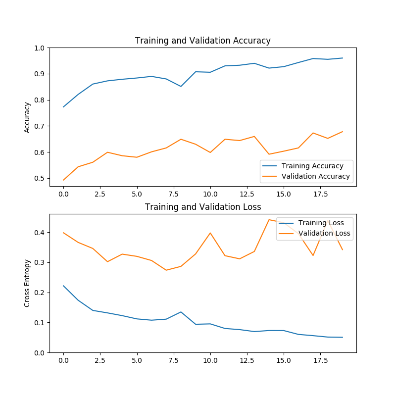
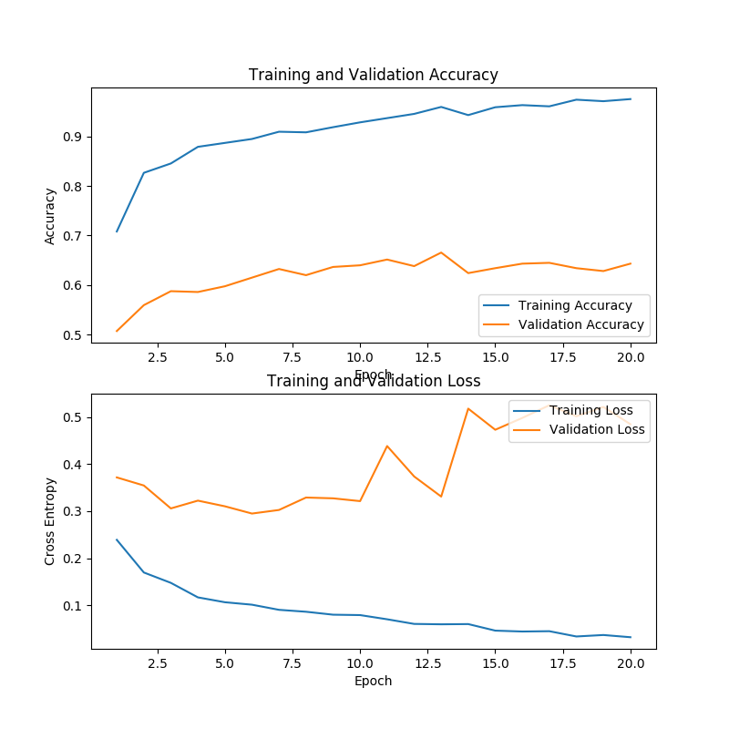
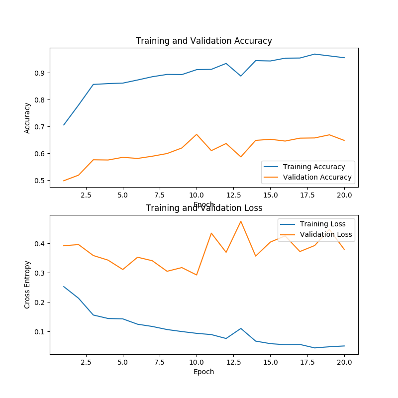
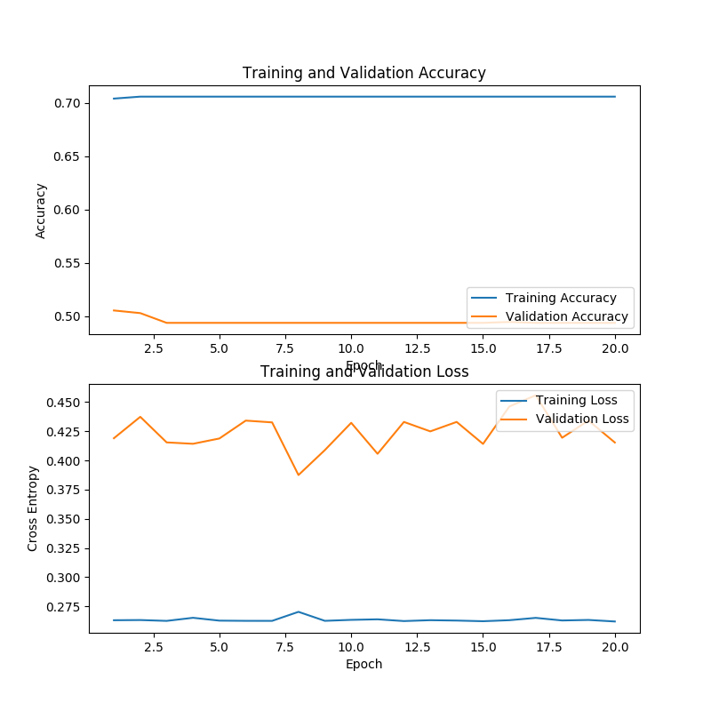
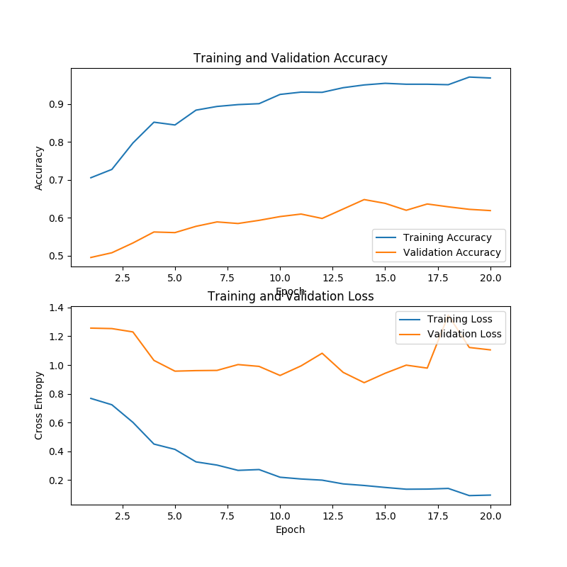
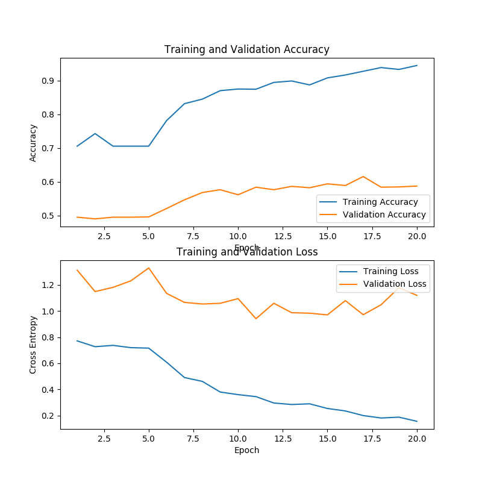
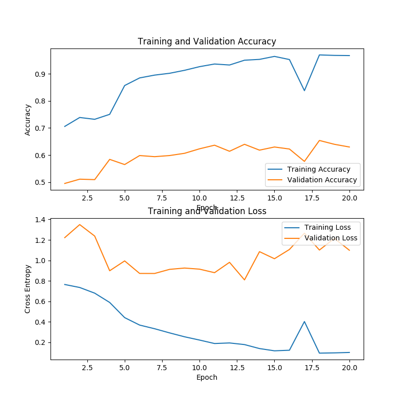
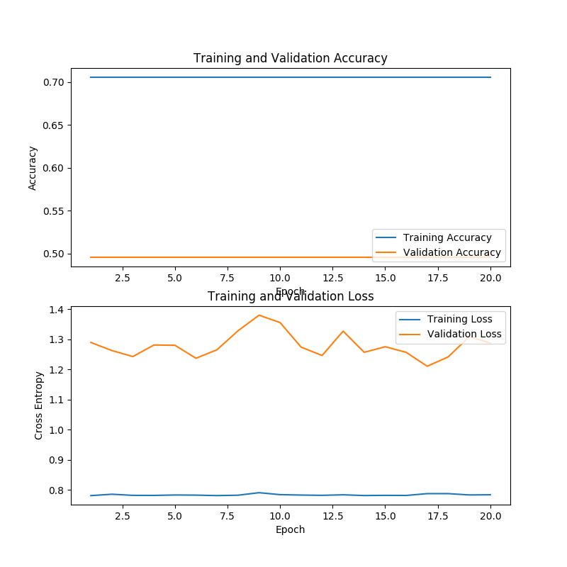
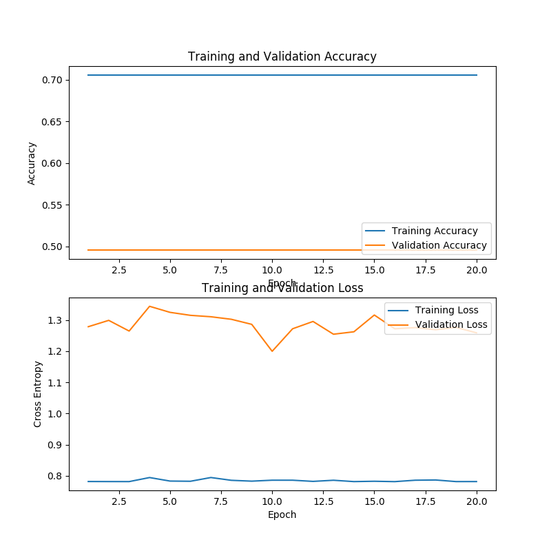

# Domain Adaptation Test with Different Models.

### separate domain train & Test
### mix of domains train & Test(train will have small amount from other domain & test will have complete data)

## Metrics to validate model

#### Different Model architecture
1. logistic regression with LSTM - input(text & label) - pretrained-feature(word2vec,hotvec)
1. logistic regression with LSTM - input(text & label) - pretrained-feature(BERT)
2. CEA - input(text, entity , entity_distance_loc & label) - pretrained-feature(word2vec,hotvec)
2. CEA - input(text, entity , entity_distance_loc & label) - pretrained-feature(BERT)
3. & others..

#### Test Metrics(data distribution & measurement)
1. proper randomly sampled train/test dataset (may or maynot same feature in both)
2. proper randomly sampled train/test dataset with test having new feature
3. after applying 1. then try with different domain.

1. Accuracy , F1 score , Recall

## Result Analysis

### info on data
    
    Using Ms data 
    maxlen: 68 61 avg : 21 choosen : 45
    oringin length of word_dict: 400000 ,length of w2v 400000
    Shape of PreEmbedding is (800000, 300)
    modified length of word_dict: 800000 ,length of w2v 800000
    
    Using St data 
    maxlen: 68 61 avg : 24 choosen : 45
    oringin length of word_dict: 400000 ,length of w2v 400000
    Shape of PreEmbedding is (800000, 300)
    modified length of word_dict: 800000 ,length of w2v 800000

## new correct data

## data train/test(2 domain data "ms(finance) & St(News)". file name starts with ms_St are combined one)
      number_of_samples file_name
      400000 glove.6B.300d.txt
      2387 ms_cleaned_data.txt
      2669 ms_St1k_train_data.txt
      1216 ms_St500_test_data.txt
      6670 ms_St5k_train_data.txt
     19026 ms_St_tag_data.txt
      2386 ms_tag_data.txt
       716 ms_test_data.txt
      1670 ms_train_data.txt
     16640 St_tag_data.txt
       500 St_test_cleaned_data_500.txt
      1657 St_test_cleaned_data.txt
      1656 St_test_data.txt
       999 St_train_cleaned_data_1k.txt
      5000 St_train_cleaned_data_5k.txt
     14985 St_train_cleaned_data.txt
     14984 St_train_data.txt
     
     maxlen of text from samples: 68 61 , avg len of text : 21 , but choosen len is : 45

#### model parametrers default
`batch_size_init = 25
n_hidden_init = 300
learning_rate_init = 0.001
n_class_init = 3
l2_reg_init = 0.001
n_iter_init = 20
keep_prob1_init = 0.5
keep_prob2_init = 0.5
method = 'CEA'
hopnum = 3`

## Using CEA
### ms data(1670/716)
#### Train 
Optimization Finished! Max acc=0.8393854748603352
mathod=	CEA	acc=	0.8044692737430168	Learning_rate=	0.001	iter_num=	20	batch_size=	25	hidden_num=	300	l2=	0.001	traintime=	225.2829873561859	testtime=	0.5097455978393555	hopnum=	3	maxacc=	0.8393854748603352
#### Test
same domain -- inside restore : all samples=716, correct prediction=576.0 mini-batch loss=0.236630, test acc=0.804469 Precision 0.8044692737430168 Recall 0.8044692737430168 f1_score 0.8044692737430168

other domain -- inside restore : all samples=1616, correct prediction=802.0 mini-batch loss=0.521461, test acc=0.496287 Precision 0.48538961038961037 Recall 0.48538961038961037 f1_score 0.48538961038961037

### ms-St5k combined
### Train
Optimization Finished! Max acc=0.8337988826815642
mathod=	CEA	acc=	0.7960893854748603	Learning_rate=	0.001	iter_num=	20	batch_size=	25	hidden_num=	300	l2=	0.001	traintime=	226.54923248291016	testtime=	0.5899763107299805	hopnum=	3	maxacc=	0.8337988826815642
### Test
other domain -- inside restore : all samples=1616, correct prediction=679.0 mini-batch loss=0.576037, test acc=0.420173 Precision 0.35714285714285715 Recall 0.35714285714285715 f1_score 0.35714285714285715

### ms-St5k  & 500-test combined & tag-data combined
### Train
### Test

### Tuning
### tuning-appr-1
1. dropout(h = tf.nn.dropout(h, keep_prob=self.keep_prob2))
2. numhop = 2
### Train
### Test

### ms-St1k-train & 500-test combined
### Train
Iter 19: mini-batch loss=0.034336, train acc=0.971306 Precision 0.9764890282131662 Recall 0.9764890282131662 f1_score 0.9764890282131662
Optimization Finished! Max acc=0.6622406639004149 mathod=	CEA	acc=	0.6531120331950208	Learning_rate=	0.001	iter_num=	20	batch_size=	25	hidden_num=	300	l2=	0.001	traintime=	226.72341585159302	testtime=	0.6271693706512451	hopnum=	3	maxacc=	0.6622406639004149
### Test
inside restore : all samples=1616, correct prediction=631.0 mini-batch loss=0.733279, test acc=0.390470 Precision 0.3538961038961039 Recall 0.3538961038961039 f1_score 0.3538961038961039

### ms-St1k-train & 500-test combined & tag-data combined
### Train
Iter 19: mini-batch loss=0.036547, train acc=0.966422 Precision 0.9717868338557993 Recall 0.9717868338557993 f1_score 0.9717868338557993
Optimization Finished! Max acc=0.6871369294605809 mathod=	CEA	acc=	0.6738589211618258	Learning_rate=	0.001	iter_num=	20	batch_size=	25	hidden_num=	300	l2=	0.001	traintime=	229.61609601974487	testtime=	0.6905889511108398	hopnum=	3	maxacc=	0.6871369294605809
### Test
inside restore : all samples=1616, correct prediction=723.0 mini-batch loss=0.644497, test acc=0.447401 Precision 0.413961038961039 Recall 0.413961038961039 f1_score 0.413961038961039

`
classification_report                precision    recall  f1-score   support

           0       0.10      0.38      0.16        34
           1       0.74      0.37      0.49       438
           2       0.30      0.55      0.39       144

   micro avg       0.41      0.41      0.41       616
   macro avg       0.38      0.43      0.35       616
weighted avg       0.60      0.41      0.45       616
`
#### Above approach has train acc more compare to test. so it reflects overfitting. need to parameter tuning.
1. number hop needs to be reduced.
2. dropout needs to be applied at each layer.
3. regularization needs to be applied to loss function.
1. TRansfer learning 

## tuning
### tuning-appr-1
1. dropout(h = tf.nn.dropout(h, keep_prob=self.keep_prob2))
2. numhop = 2
### Train
Iter 19: mini-batch loss=0.050376, train acc=0.959707
Precision 0.9655172413793104
Recall 0.9655172413793104
f1_score 0.9655172413793104
Optimization Finished! Max acc=0.6780082987551868
mathod=	CEA	acc=	0.6780082987551868	Learning_rate=	0.001	iter_num=	20	batch_size=	25	hidden_num=	300	l2=	0.001	traintime=	209.84021306037903	testtime=	0.6046509742736816	hopnum=	2	maxacc=	0.6780082987551868

### Test
### tuning-appr-2
1. dropout(h = tf.nn.dropout(h, keep_prob=self.keep_prob2))
2. numhop = 2
3. keep_prob3 = 0.8
### Train
Iter 19: mini-batch loss=0.032403, train acc=0.975580
Precision 0.9749216300940439
Recall 0.9749216300940439
f1_score 0.9749216300940439
Optimization Finished! Max acc=0.6655601659751037
mathod=	CEA	acc=	0.6431535269709544	Learning_rate=	0.001	iter_num=	20	batch_size=	25	hidden_num=	300	l2=	0.001	traintime=	208.64779591560364	testtime=	0.5981981754302979	hopnum=	2	maxacc=	0.6655601659751037

### Test
`
inside restore : 
all samples=1616, correct prediction=656.0
mini-batch loss=0.777720, test acc=0.405941
Precision 0.42045454545454547
Recall 0.42045454545454547
f1_score 0.42045454545454547
classification_report                precision    recall  f1-score   support

           0       0.09      0.41      0.15        34
           1       0.74      0.41      0.53       438
           2       0.30      0.47      0.37       144

   micro avg       0.42      0.42      0.42       616
   macro avg       0.38      0.43      0.35       616
weighted avg       0.60      0.42      0.47       616`
### tuning-appr-2.1
1. dropout(h = tf.nn.dropout(h, keep_prob=self.keep_prob2))
2. numhop = 1
3. keep_prob3 = 0.8
### Train
Iter 19: mini-batch loss=0.050481, train acc=0.956044
Precision 0.9592476489028213
Recall 0.9592476489028213
f1_score 0.9592476489028213
Optimization Finished! Max acc=0.6705394190871369
mathod=	CEA	acc=	0.6481327800829876	Learning_rate=	0.001	iter_num=	20	batch_size=	25	hidden_num=	300	l2=	0.001	traintime=	203.48558473587036	testtime=	0.3711111545562744	hopnum=	1	maxacc=	0.6705394190871369

### Test
inside restore : 
all samples=1616, correct prediction=593.0
mini-batch loss=0.652048, test acc=0.366955
Precision 0.3181818181818182
Recall 0.3181818181818182
f1_score 0.3181818181818182
`classification_report                precision    recall  f1-score   support

           0       0.10      0.53      0.16        34
           1       0.78      0.19      0.31       438
           2       0.29      0.66      0.41       144

   micro avg       0.32      0.32      0.32       616
   macro avg       0.39      0.46      0.29       616
weighted avg       0.63      0.32      0.32       616`
### tuning-appr-2.2
1. dropout(h = tf.nn.dropout(h, keep_prob=self.keep_prob2))
2. numhop = 0
3. keep_prob3 = 0.8
### Train
Iter 19: mini-batch loss=0.262103, train acc=0.705739
Precision 0.6990595611285266
Recall 0.6990595611285266
f1_score 0.6990595611285266
Optimization Finished! Max acc=0.5053941908713693
mathod=	CEA	acc=	0.49377593360995853	Learning_rate=	0.001	iter_num=	20	batch_size=	25	hidden_num=	300	l2=	0.001	traintime=	79.28670072555542	testtime=	0.014913558959960938	hopnum=	0	maxacc=	0.5053941908713693

### Test
inside restore : 
all samples=1616, correct prediction=365.0
mini-batch loss=0.615387, test acc=0.225866
Precision 0.23214285714285715
Recall 0.23214285714285715
f1_score 0.23214285714285715
`UndefinedMetricWarning: Precision and F-score are ill-defined and being set to 0.0 in labels with no predicted samples.
  'precision', 'predicted', average, warn_for)
classification_report                precision    recall  f1-score   support

           0       0.00      0.00      0.00        34
           1       0.00      0.00      0.00       438
           2       0.23      0.99      0.38       144

   micro avg       0.23      0.23      0.23       616
   macro avg       0.08      0.33      0.13       616
weighted avg       0.05      0.23      0.09       616
`
## Using SLSTM

### ms-St1k-train & 500-test combined & tag-data combined
### Train
Iter 19: mini-batch loss=0.095464, train acc=0.968864
Precision 0.9733542319749217
Recall 0.9733542319749217
f1_score 0.9733542319749217
Optimization Finished! Max acc=0.6481327800829876
mathod=	SLSTM	acc=	0.6190871369294606	Learning_rate=	0.001	iter_num=	20	batch_size=	25	hidden_num=	300	l2=	0.001	traintime=	118.92423415184021	testtime=	0.23511624336242676	hopnum=	0	maxacc=	0.6481327800829876

### Test
inside restore : 
all samples=1616, correct prediction=550.0
mini-batch loss=1.868114, test acc=0.340347
Precision 0.3457792207792208
Recall 0.3457792207792208
f1_score 0.3457792207792208

`classification_report                precision    recall  f1-score   support

           0       0.12      0.32      0.17        34
           1       0.84      0.17      0.28       438
           2       0.30      0.90      0.44       144

   micro avg       0.35      0.35      0.35       616
   macro avg       0.42      0.46      0.30       616
weighted avg       0.67      0.35      0.31       616
`
## tuning
### tuning-appr-1
1. dropout(hidden = tf.nn.dropout(hidden, keep_prob=self.keep_prob2))
2. numhop = 0
### Train
Iter 19: mini-batch loss=0.157019, train acc=0.944444
Precision 0.9498432601880877
Recall 0.9498432601880877
f1_score 0.9498432601880877
Optimization Finished! Max acc=0.6157676348547718
mathod=	SLSTM	acc=	0.587551867219917	Learning_rate=	0.001	iter_num=	20	batch_size=	25	hidden_num=	300	l2=	0.001	traintime=	118.43086242675781	testtime=	0.22070622444152832	hopnum=	0	maxacc=	0.6157676348547718

### Test
inside restore : 
all samples=1616, correct prediction=377.0
mini-batch loss=1.947272, test acc=0.233292
Precision 0.21103896103896103
Recall 0.21103896103896103
f1_score 0.21103896103896103
`
classification_report                precision    recall  f1-score   support

           0       0.10      0.65      0.17        34
           1       0.73      0.02      0.04       438
           2       0.26      0.69      0.38       144

   micro avg       0.21      0.21      0.21       616
   macro avg       0.36      0.45      0.20       616
weighted avg       0.58      0.21      0.12       616`
### tuning-appr-2
1. dropout(hidden = tf.nn.dropout(hidden, keep_prob=self.keep_prob2))
2. numhop = 0
3. l2-regularisation
### Train
Iter 19: mini-batch loss=0.101555, train acc=0.967033
Precision 0.9733542319749217
Recall 0.9733542319749217
f1_score 0.9733542319749217
Optimization Finished! Max acc=0.653941908713693
mathod=	SLSTM	acc=	0.6298755186721992	Learning_rate=	0.001	iter_num=	20	batch_size=	25	hidden_num=	300	l2=	0.001	traintime=	119.1012909412384	testtime=	0.23305153846740723	hopnum=	0	maxacc=	0.653941908713693

### tuning-appr-2.1(lstm-rnn-dropout-l2)
1. dropout(hidden = tf.nn.dropout(hidden, keep_prob=self.keep_prob2))
2. numhop = 0
3. l2-regularisation
4. n_layer = 2
### Train
Iter 19: mini-batch loss=0.784495, train acc=0.705739
Precision 0.6990595611285266
Recall 0.6990595611285266
f1_score 0.6990595611285266
Optimization Finished! Max acc=0.4954356846473029
mathod=	MLSTM	acc=	0.4954356846473029	Learning_rate=	0.001	iter_num=	20	batch_size=	25	hidden_num=	300	l2=	0.001	traintime=	173.62671947479248	testtime=	0.5884609222412109	hopnum=	0	maxacc=	0.4954356846473029

### Test
inside restore : 
all samples=1616, correct prediction=366.0
mini-batch loss=1.940905, test acc=0.226485
Precision 0.23376623376623376
Recall 0.23376623376623376
f1_score 0.23376623376623376
`Precision and F-score are ill-defined and being set to 0.0 in labels with no predicted samples.
  'precision', 'predicted', average, warn_for)
classification_report                precision    recall  f1-score   support

           0       0.00      0.00      0.00        34
           1       0.00      0.00      0.00       438
           2       0.23      1.00      0.38       144

   micro avg       0.23      0.23      0.23       616
   macro avg       0.08      0.33      0.13       616
weighted avg       0.05      0.23      0.09       616`
### tuning-appr-2.1(Bi-lstm-dropout-l2) with nn.staticBidirectional_lstm
1. dropout(hidden = tf.nn.dropout(hidden, keep_prob=self.keep_prob2))
2. numhop = 0
3. l2-regularisation
### Train
all samples=1205, correct prediction=597.0
Iter 19: mini-batch loss=1.259123, test acc=0.495436
all samples=1638, correct prediction in train=1156.0
Iter 19: mini-batch loss=0.781837, train acc=0.705739
Precision 0.6990595611285266
Recall 0.6990595611285266
f1_score 0.6990595611285266
Optimization Finished! Max acc=0.4954356846473029
mathod=	BiLSTM	acc=	0.4954356846473029	Learning_rate=	0.001	iter_num=	20	batch_size=	25	hidden_num=	300	l2=	0.001	traintime=	122.13503646850586	testtime=	0.23301935195922852	hopnum=	0	maxacc=	0.4954356846473029

### Test
inside restore : 
all samples=1616, correct prediction=366.0
mini-batch loss=1.882008, test acc=0.226485
Precision 0.23376623376623376
Recall 0.23376623376623376
f1_score 0.23376623376623376
`Precision and F-score are ill-defined and being set to 0.0 in labels with no predicted samples.
  'precision', 'predicted', average, warn_for)
classification_report                precision    recall  f1-score   support

           0       0.00      0.00      0.00        34
           1       0.00      0.00      0.00       438
           2       0.23      1.00      0.38       144

   micro avg       0.23      0.23      0.23       616
   macro avg       0.08      0.33      0.13       616
weighted avg       0.05      0.23      0.09       616
`
### tuning-appr-2.1(Bi-lstm-dropout-l2) with nn.dynamic_idirectional_lstm
1. dropout(hidden = tf.nn.dropout(hidden, keep_prob=self.keep_prob2))
2. numhop = 0
3. l2-regularisation
### Train
Iter 19: mini-batch loss=0.781660, train acc=0.705739
Precision 0.6990595611285266
Recall 0.6990595611285266
f1_score 0.6990595611285266
Optimization Finished! Max acc=0.2264851485148515
mathod=	BiLSTM	acc=	0.2264851485148515	Learning_rate=	0.001	iter_num=	20	batch_size=	25	hidden_num=	300	l2=	0.001	traintime=	174.52773714065552	testtime=	0.5567402839660645	hopnum=	0	maxacc=	0.2264851485148515
### tuning-appr-2.1(Bi-lstm-dropout-l2) with nn.dynamic_idirectional_lstm with layer 2
1. dropout(hidden = tf.nn.dropout(hidden, keep_prob=self.keep_prob2))
2. numhop = 0
3. l2-regularisation
### Train
Iter 19: mini-batch loss=0.771101, train acc=0.705739
Precision 0.6990595611285266
Recall 0.6990595611285266
f1_score 0.6990595611285266
Optimization Finished! Max acc=0.2264851485148515
mathod=	BiLSTM	acc=	0.2264851485148515	Learning_rate=	0.001	iter_num=	20	batch_size=	25	hidden_num=	300	l2=	0.001	traintime=	317.6096820831299	testtime=	1.261897325515747	hopnum=	0	maxacc=	0.2264851485148515
### tuning-appr-2.1(conv-lstm-dropout-l2)
2. numhop = 0
3. l2-regularisation
### Train
Iter 3: mini-batch loss=0.525118, train acc=0.833333
Precision 0.8385579937304075
Recall 0.8385579937304075
f1_score 0.8385579937304075
Optimization Finished! Max acc=0.2264851485148515
mathod=	ConvLSTM	acc=	0.17945544554455445	Learning_rate=	0.001	iter_num=	20	batch_size=	25	hidden_num=	300	l2=	0.001	traintime=	105.51120042800903	testtime=	1.0928564071655273	hopnum=	0	maxacc=	0.2264851485148515

# Domain Adaptation Test with Bert.

### separate domain train & Test
### mix of domains train & Test(train will have small amount from other domain & test will have complete data)

### Bert Default Config
`Model config {
  "attention_probs_dropout_prob": 0.1,
  "hidden_act": "gelu",
  "hidden_dropout_prob": 0.1,
  "hidden_size": 768,
  "initializer_range": 0.02,
  "intermediate_size": 3072,
  "max_position_embeddings": 512,
  "num_attention_heads": 12,
  "num_hidden_layers": 12,
  "type_vocab_size": 2,
  "vocab_size": 30522
}`

### data & label-wise distribution
`1. two domains are. finance(ms) & news(St)`
1669 -- ms_train
715 -- ms_test
1655 -- St_test
14983 -- St_train
2669 -- ms_St_1k
1215 -- ms_St500_test
6669 -- ms_St_5k
`
St-5k
0       440      0       440
1      3382      0      3382
2      1069      0      1069
`
`
St_1k
0       90      0        90
1      680      0       680
2      208      0       208
`
`ms_St_5k::
0       788      0       788
1      3524      0      3524
2      2248      0      2248`
`
ms_St_1k::
0       438      0       438
1       822      0       822
2      1387      0      1387
`
`
ms_St500_test
0      189      0       189
1      427      0       427
2      598      0       598
`
`
St_test
label                       
0       121      0       121
1      1154      0      1154
2       365      0       365
`
`
St_train
0       1091      0      1091
1      10359      0     10359
2       3292      0      3292
`
`
ms_test
0      152      0       152
1       74      0        74
2      488      0       488
`
`
ms_train
0       348      0       348
1       141      0       141
2      1179      0      1179
`
### ms-1(same domain train/dev(1669/715)) ?below 90 because of non-equal or imbalance distribution of features.
09/12/2019 08:40:36 - INFO - __main__ -   ***** Running evaluation *****
09/12/2019 08:40:36 - INFO - __main__ -     Num examples = 715
09/12/2019 08:40:36 - INFO - __main__ -     Batch size = 8
Evaluating: 100%|███████████████████████████████| 90/90 [00:23<00:00,  4.49it/s]
09/12/2019 08:40:59 - INFO - __main__ -   ***** Eval results *****
09/12/2019 08:40:59 - INFO - __main__ -     eval_accuracy = 0.8643356643356643
09/12/2019 08:40:59 - INFO - __main__ -     eval_loss = 0.38533345030413735
09/12/2019 08:40:59 - INFO - __main__ -     global_step = 159
09/12/2019 08:40:59 - INFO - __main__ -     loss = 0.2732406849006437
### ms-1(other domain train/dev(1669/1655))
09/12/2019 08:51:53 - INFO - __main__ -   ***** Running evaluation *****
09/12/2019 08:51:53 - INFO - __main__ -     Num examples = 1655
09/12/2019 08:51:53 - INFO - __main__ -     Batch size = 8
Evaluating: 100%|█████████████████████████████| 207/207 [00:53<00:00,  3.92it/s]
09/12/2019 08:52:47 - INFO - __main__ -   ***** Eval results *****
09/12/2019 08:52:47 - INFO - __main__ -     eval_accuracy = 0.5444108761329305
09/12/2019 08:52:47 - INFO - __main__ -     eval_loss = 0.9103068450222844
09/12/2019 08:52:47 - INFO - __main__ -     global_step = 159
09/12/2019 08:52:47 - INFO - __main__ -     loss = 0.2732406849006437
### St-1(same domain train/dev(14983/1655)
09/12/2019 09:36:47 - INFO - __main__ -   ***** Running evaluation *****
09/12/2019 09:36:47 - INFO - __main__ -     Num examples = 1655
09/12/2019 09:36:47 - INFO - __main__ -     Batch size = 8
Evaluating: 100%|█████████████████████████████| 207/207 [00:53<00:00,  3.92it/s]
09/12/2019 09:37:40 - INFO - __main__ -   ***** Eval results *****
09/12/2019 09:37:40 - INFO - __main__ -     eval_accuracy = 0.9993957703927493
09/12/2019 09:37:40 - INFO - __main__ -     eval_loss = 0.0014353839588882446
09/12/2019 09:37:40 - INFO - __main__ -     global_step = 1407
09/12/2019 09:37:40 - INFO - __main__ -     loss = 0.0018695864883779701
### St-1(other domain train/dev(14983/1669)
09/12/2019 11:27:39 - INFO - __main__ -   ***** Running evaluation *****
09/12/2019 11:27:39 - INFO - __main__ -     Num examples = 1669
09/12/2019 11:27:39 - INFO - __main__ -     Batch size = 8
Evaluating: 100%|█████████████████████████████| 209/209 [00:53<00:00,  4.31it/s]
09/12/2019 11:28:32 - INFO - __main__ -   ***** Eval results *****
09/12/2019 11:28:32 - INFO - __main__ -     eval_accuracy = 0.463151587777112
09/12/2019 11:28:32 - INFO - __main__ -     eval_loss = 2.6307097941494444
09/12/2019 11:28:32 - INFO - __main__ -     global_step = 0
09/12/2019 11:28:32 - INFO - __main__ -     loss = None
### ms_St1k(mix domain train/dev(2669/1215(715+499)) -- both mixed
09/12/2019 10:26:32 - INFO - __main__ -   ***** Running evaluation *****
09/12/2019 10:26:32 - INFO - __main__ -     Num examples = 1215
09/12/2019 10:26:32 - INFO - __main__ -     Batch size = 8
Evaluating: 100%|█████████████████████████████| 152/152 [00:39<00:00,  3.92it/s]
09/12/2019 10:27:11 - INFO - __main__ -   ***** Eval results *****
09/12/2019 10:27:11 - INFO - __main__ -     eval_accuracy = 0.8691358024691358
09/12/2019 10:27:11 - INFO - __main__ -     eval_loss = 0.3954785704171579
09/12/2019 10:27:11 - INFO - __main__ -     global_step = 252
09/12/2019 10:27:11 - INFO - __main__ -     loss = 0.2576741098115842
### ms_St1k(mix domain train/dev(2669/1655) -- only train mixed
09/12/2019 11:26:14 - INFO - __main__ -   ***** Running evaluation *****
09/12/2019 11:26:14 - INFO - __main__ -     Num examples = 1655
09/12/2019 11:26:14 - INFO - __main__ -     Batch size = 8
Evaluating: 100%|█████████████████████████████| 207/207 [00:53<00:00,  3.94it/s]
09/12/2019 11:27:07 - INFO - __main__ -   ***** Eval results *****
09/12/2019 11:27:07 - INFO - __main__ -     eval_accuracy = 0.8628398791540786
09/12/2019 11:27:07 - INFO - __main__ -     eval_loss = 0.3947008856108799
09/12/2019 11:27:07 - INFO - __main__ -     global_step = 0
09/12/2019 11:27:07 - INFO - __main__ -     loss = None

### ms_St5k(mix domain train/dev(6669/1215(715+499)) -- both mixed
09/12/2019 10:48:07 - INFO - __main__ -   ***** Running evaluation *****
09/12/2019 10:48:07 - INFO - __main__ -     Num examples = 1215
09/12/2019 10:48:07 - INFO - __main__ -     Batch size = 8
Evaluating: 100%|█████████████████████████████| 152/152 [00:39<00:00,  3.91it/s]
09/12/2019 10:48:46 - INFO - __main__ -   ***** Eval results *****
09/12/2019 10:48:46 - INFO - __main__ -     eval_accuracy = 0.9119341563786009
09/12/2019 10:48:46 - INFO - __main__ -     eval_loss = 0.2689976730157229
09/12/2019 10:48:46 - INFO - __main__ -     global_step = 627
09/12/2019 10:48:46 - INFO - __main__ -     loss = 0.05752838208032638
### ms_St5k(mix domain train/dev(6669/1655) -- only train mixed
09/12/2019 11:24:46 - INFO - __main__ -   label: 1 (id = 1)
09/12/2019 11:24:47 - INFO - __main__ -   ***** Running evaluation *****
09/12/2019 11:24:47 - INFO - __main__ -     Num examples = 1655
09/12/2019 11:24:47 - INFO - __main__ -     Batch size = 8
Evaluating: 100%|█████████████████████████████| 207/207 [00:53<00:00,  3.93it/s]
09/12/2019 11:25:41 - INFO - __main__ -   ***** Eval results *****
09/12/2019 11:25:41 - INFO - __main__ -     eval_accuracy = 0.9317220543806647
09/12/2019 11:25:41 - INFO - __main__ -     eval_loss = 0.2950709961030794
09/12/2019 11:25:41 - INFO - __main__ -     global_step = 627
09/12/2019 11:25:41 - INFO - __main__ -     loss = 0.05752838208032638